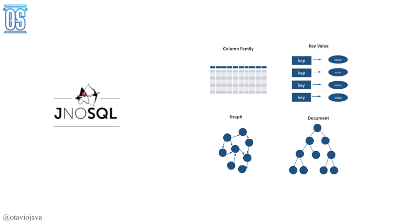
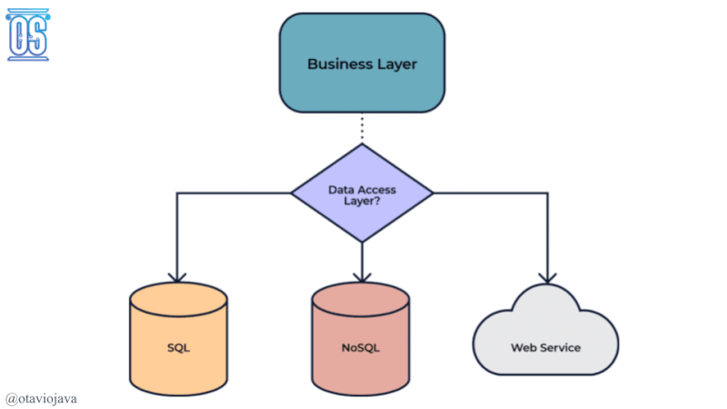

= Jakarta NoSQL and Data with MongoDB

@otaviojava

== Topics for today:

* Why do we care about data?
** History (useless information, sorry, but I love history)
* Challenges on Data
* Why Jakarta?
* Jakarta NoSQL
* Jakarta Data
* Show me the code

== Jakarta NoSQL

== Jakarta Data

== Start the code

* Install docker: https://www.docker.com/
* https://hub.docker.com/r/couchbase/server/
* Run three Docker commands
** `docker run -d --name mongodb-instance -p 27017:27017 mongo`
** `docker run -e ARANGO_NO_AUTH=1 -d --name arangodb-instance -p 8529:8529 -d arangodb/arangodb`
** `docker run -d --name db -p 8091-8097:8091-8097 -p 9123:9123 -p 11207:11207 -p 11210:11210 -p 11280:11280 -p 18091-18097:18091-18097 couchbase`
* You also have the option for running docker-compose:
** `docker-compose up -d`
* Execute the test `mvn clean verify`

== Couchbase Configuration

1. Access: http://localhost:8091/ui/index.html
1. Select the option "Setup New Cluster"
1. Define "root" as Admin username
1. Define "123456" as Password
1. Define "localhost" as Cluster Name
1. Accept the terms and conditions
1. Go to "Buckets" session
1. Create Bucket "beers" using the "Add Bucket" Option
1. Click at "beers"
1. Add "Hero" and "Villain" as Collection
1. Go to Query session and execute: CREATE PRIMARY INDEX #primary ON factory._default.beer

== References

* https://jakarta.ee/specifications/nosql/[Jakarta NoSQL]
* https://jakarta.ee/specifications/data/[Jakarta Data]
* https://microprofile.io/[Eclipse Microprofile]
* https://jakarta.ee/[Jakarta EE]